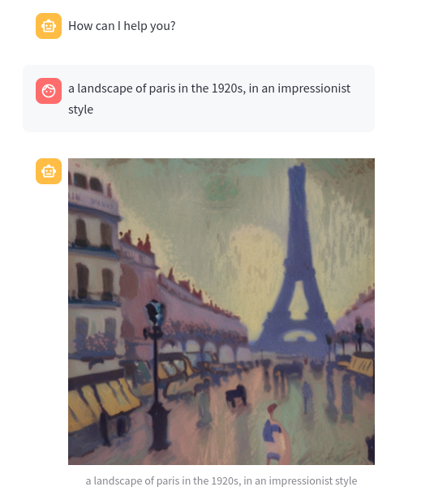

# **Kickmaker Chatbot : How to play with GenAI at home**
## Let’s get started !
### Requirements 
This project is meant to run on a Ubuntu computer with at least 12 GB of VRAM (GPU).

First you will need to pull LLAMA 3 locally using Ollama.
If you need to install Ollama on your machine, you can run this command :
```sh
curl https://ollama.ai/install.sh | sh
```
Now you can pull the LLM model locally by typing this command :
```sh
ollama pull llama3
```

Before installing the package, we recommend using a python environment. You can create one using these commands.
```sh
sudo apt install python3-virtualenv
virtualenv -p python3 venv
source venv/bin/activate
```

From now you can install our project as a standalone package by using the following command 
```sh
pip install git+https://github.com/kickmaker/kickmaker-chatbot.git
```

### Launching the program
Everything is already packaged , so now you can just import the library as a package and use it.
```py
import kickbot

kickbot.kickbot()
```
However it is **very important** that you run your own app using the following structure. 
```sh
streamlit run your_app.py --server.fileWatcherType none
```

When playing with PDF files, please **remove all PDF files from the web app** if you want to clean the vector database (this backend part hasn’t been implemented).

### How it works ?
#### Streamlit App
The Streamlit process is running in the *main.py* file. 

We first use ***session_state*** modules to store persistent data, such as the different class instances and the uploaded file names.

```py 
import streamlit as st

# create instances for each process and store them in the session 
if "models" not in st.session_state.keys():
    query_llm = rag_llm()
    langchain_llm = langchain()
    image_gen = img_gen()
    st.session_state["models"] = [query_llm, langchain_llm, image_gen]

# recover the stored instances
query_llm, langchain_llm, image_gen = st.session_state["models"]
```

Then we use a custom HTML code to display a banner. 

```py 
# Display the custom HTML
st.set_page_config(layout="wide")
st.components.v1.html(custom_html)

# print the main title
st.title("Kickmaker AI bot !")
```

The page layout is built afterwards. 

We want our layout to display a sidebar where we will be able to input files.

```py
# Sidebar content
st.sidebar.header("Tools")
st.sidebar.subheader("Upload Files")

# create a file uploader module 
uploaded_file = st.sidebar.file_uploader("Upload files to add to your knowledge data base", type=['pdf'], accept_multiple_files=True)
```

The next step is to check if a new file was uploaded, in which case we will get the vector database and upload the file to it. If we had files and we removed all of them from the sidebar, then we will erase the vector DB.

```py
# check if a new pdf file was uploaded
if uploaded_file:
    # Set the boolean to True if files are present
    st.session_state["files"] = True
    # recover the chroma DB 
    query_llm.get_chroma()
    # add the new files to the chroma DB
    query_llm.upload_data(uploaded_file)

# check if all pdf have been deleted 
if not uploaded_file and st.session_state["files"] is True:
    # Set the boolean to False if files have been removed
    st.session_state["files"] = False
    # delete the chroma DB
    query_llm.remove_chroma()
    # recreate a new empty one+
    query_llm.get_chroma()
```

Then the program will display the discussion between the bot and the user. If it is starting, then we display a welcome message.

```py
# If the program is starting and there is no messages at all
if "messages" not in st.session_state:
    # print a welcoming message to engage the discussion"
    st.session_state["messages"] = [{"role": "assistant", "content": "How can I help you?"}]

# check the message buffer and display the new ones
for msg in st.session_state["messages"]:
    st.chat_message(msg["role"]).write(msg["content"])
```

Now comes the fun part, we wait for the user to input a question, then we have a first LLM call to determine what type of query it is between a classic question, a pdf resume or an image generation. 

```py
# check whether the user wants a text answer or a generated image
query_type = langchain_llm.get_query_type(question)
```

If we want an image we get the cleaned image prompt and then call the generation tool, finally we push he new image to the discussion. 

```py
# create an adequate LangChain prompt to generate images
prompt = langchain_llm.get_chatbot_answer(question, query_type="img")
# call the Stable Diffusion model to generate the image
image = image_gen.generate_img(question)  
# send the image to the message buffer
st.image(image, caption=question, use_column_width=True)
```

On the other hand if we want a text answer we will search the vector DB for context and then query the LLM with both the question and context, finally we push the answer to the discussion.

```py
# query the pdf DB for useful data
context = query_llm.search_chroma(question, query_type)
# get a proper answer based on this useful data and the model's knowledge 
answer = langchain_llm.get_chatbot_answer(question, context=context, query_type=query_type)
# send the text to the message buffer
st.write(answer)
```

#### LangChain
The LangChain process is running in the *Langchain.py* file within the class of the same name. The class contains several chain template depending on the type of the query. It set up the LLM at initialisation. We set a “Temperature” of 0.1 which means the model will have a rather common and conservative output when answering.

```py
from langchain_community.chat_models import ChatOllama
# create an instance of the LLM model, in our case the LLAMA3 from Meta
llm = ChatOllama(model="llama3", temperature=0.1)
```

Once the query is asked by the user, we want to classify it to know which action to make. We call use the template dedicated to this task and then run a first LLM call without context. This will return the type of the query as a string : Text, Resume, Image.

```py
# create a prompt based on the query template
prompt = self.get_prompt("query")
# create a LangChain chain with the prompt and the llm
chain = prompt | self.llm | StrOutputParser()
# recover the type
query_type = chain.invoke({"question": question})  
```

Finally, we can get a text answer based on the query. To do so we create a chain containing the prompt template, the LLM engine and the query. Some context can be used depending on the query. The context refers to some data fetched into the vector database that relates to the question.

```py
# get the correct prompt
prompt = self.get_prompt(query_type)   
# create the chain
chain = prompt | self.llm | StrOutputParser()     
# get the answer back by passing context and the question
answer = chain.invoke({"context": context, "question": question})
```

#### The vector database and embeddings 
The RAG process including the management of the vector database is handled inside the *rag_llm.py* file. 

We get the embedding engine based on LLama3 also, set the different path to save both files and vector DB locally.	

```py
# get vector embeddings model
self.embeddings = OllamaEmbeddings(model="llama3")
```

Then we create the vector DB based on the Chroma library. 

```py
# create a DB client and a collection 
client = chromadb.PersistentClient(path=self.db_path)
collection = client.get_or_create_collection("Documents")
# create the DB and persist it
self.db = Chroma(persist_directory=self.db_path, client=client, collection_name="Documents", embedding_function=self.embeddings)
```

When a new document is uploaded, we will first split the content in chunks. The parameters used can be modified. 

```py
# instance for a text splitter
text_splitter = RecursiveCharacterTextSplitter(
    chunk_size=800,        
    chunk_overlap=100,
    length_function=len,
    add_start_index=True,
)
# make the chunks
chunks = text_splitter.split_documents(documents)
```

Then we will save these chunks to the database by converting them into embeddings, this is automatically included into the vector DB library.

```py
# Create a new DB from the documents.
self.db.add_documents(chunks)
# persist the DB so that it remains available
self.db.persist()
```

When asking the chatbot for information within the PDF we will search inside the DB for relevant data. If we asked a regular question then we will use the similarity search module and recover the top 5 chunks to help answer the question.

```py
# Search the DB for 5 closest chunks of data
results = self.db.similarity_search_with_score(question, k=5)
context = "\n\n---\n\n".join([doc.page_content for doc, _score in results])
```

If we want a full resume of the PDF file, we will return all chunks of data to be used as context for the LLM. 

```py
# get all the chunks
results = self.db.get()
context = "\n\n---\n\n".join(results["documents"])   
```

#### The image generation
The generation of images is managed inside the *img_gen.py* file. We load our model from the HuggingFace library and initialize it onto the GPU. We also set the scheduler.

```py
import torch
from diffusers import StableDiffusionPipeline, DPMSolverMultistepScheduler
# Initialize the Stable Diffusion model
model_id = "stabilityai/stable-diffusion-2-1"
# load teh pretained weights to the GPU
self.pipe = StableDiffusionPipeline.from_pretrained(model_id,
torch_dtype=torch.float16).to("cuda")
# intanciate a scheduler to improve efficiency 
self.pipe.scheduler = DPMSolverMultistepScheduler.from_config(self.pipe.scheduler.config)
```

To generate an image, we need the cleared prompt and then we call the pipeline to create it. The number of inference steps can be modified based on what you need. 

```py
# Generate the image
self.image = self.pipe(prompt=prompt, num_inference_steps=32).images[0]
```

## Conclusion
This project demonstrates the power of combining cutting-edge AI models like LLAMA3, RAG, and Stable Diffusion. The resulting chatbot offers a multifaceted experience, allowing for informative conversation, PDF analysis and a touch of creative exploration. This project has been very instructive and fun to develop. The final result isn’t perfect and a lot of improvements can be made but it is a solid foundation for anyone to play with. Here are a few screenshots of the chatbot.




Enjoy !!!
